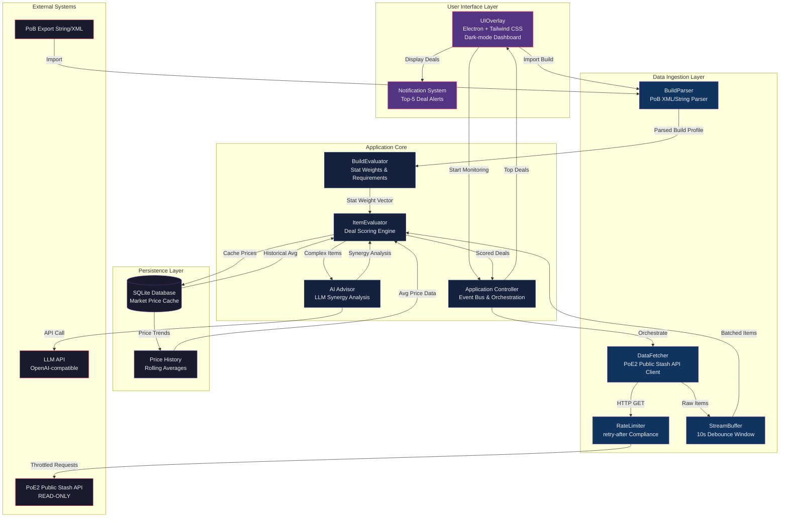
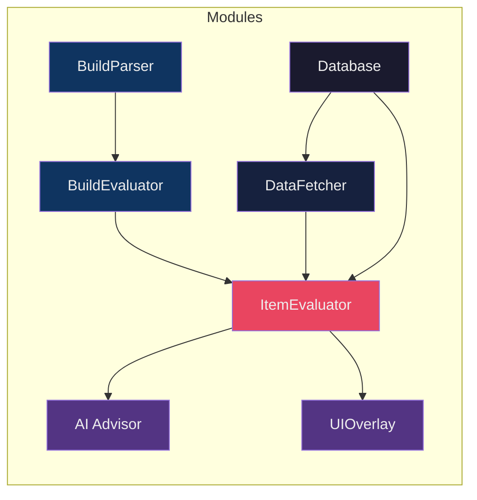
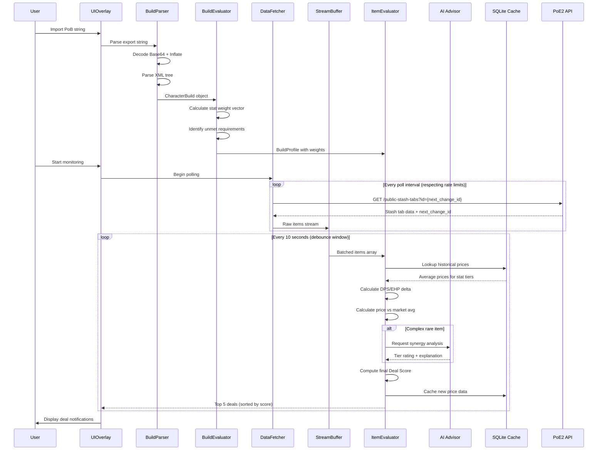

# Exile-Insight: System Architecture

## Overview

Exile-Insight is a **read-only** desktop application for Path of Exile 2 that provides
real-time trade advice and build optimization. It parses Path of Building exports,
monitors the PoE2 Public Stash API, and scores item deals against the user's build needs.

## System Architecture Diagram



## Module Dependency Flow



## Data Flow Sequence



## Item Deal JSON Schema

```json
{
  "$schema": "http://json-schema.org/draft-07/schema#",
  "title": "ItemDeal",
  "type": "object",
  "required": ["id", "item", "dealScore", "evaluation", "pricing", "timestamp"],
  "properties": {
    "id": {
      "type": "string",
      "format": "uuid",
      "description": "Unique deal identifier"
    },
    "item": {
      "$ref": "#/definitions/PoE2Item"
    },
    "dealScore": {
      "type": "number",
      "minimum": 0,
      "maximum": 100,
      "description": "Composite score: 0-100 where 100 is an unmissable deal"
    },
    "evaluation": {
      "$ref": "#/definitions/DealEvaluation"
    },
    "pricing": {
      "$ref": "#/definitions/PriceAnalysis"
    },
    "aiAnalysis": {
      "$ref": "#/definitions/AIAnalysis"
    },
    "timestamp": {
      "type": "string",
      "format": "date-time"
    }
  },
  "definitions": {
    "PoE2Item": {
      "type": "object",
      "required": ["id", "name", "baseType", "itemLevel", "rarity", "mods"],
      "properties": {
        "id": { "type": "string" },
        "name": { "type": "string" },
        "baseType": { "type": "string" },
        "itemLevel": { "type": "integer" },
        "rarity": {
          "type": "string",
          "enum": ["Normal", "Magic", "Rare", "Unique"]
        },
        "category": {
          "type": "string",
          "enum": [
            "weapon", "armour", "accessory", "gem", "jewel",
            "flask", "currency", "gold"
          ]
        },
        "mods": {
          "type": "object",
          "properties": {
            "implicit": { "type": "array", "items": { "$ref": "#/definitions/Mod" } },
            "explicit": { "type": "array", "items": { "$ref": "#/definitions/Mod" } },
            "enchant": { "type": "array", "items": { "$ref": "#/definitions/Mod" } }
          }
        },
        "requirements": {
          "type": "object",
          "properties": {
            "level": { "type": "integer" },
            "str": { "type": "integer" },
            "dex": { "type": "integer" },
            "int": { "type": "integer" }
          }
        },
        "influences": {
          "type": "array",
          "items": { "type": "string" }
        },
        "stash": {
          "type": "object",
          "properties": {
            "accountName": { "type": "string" },
            "stashName": { "type": "string" },
            "league": { "type": "string" }
          }
        },
        "listingPrice": {
          "$ref": "#/definitions/Price"
        }
      }
    },
    "Mod": {
      "type": "object",
      "required": ["text", "stats"],
      "properties": {
        "text": { "type": "string" },
        "tier": { "type": "integer" },
        "stats": {
          "type": "array",
          "items": {
            "type": "object",
            "properties": {
              "id": { "type": "string" },
              "value": { "type": "number" },
              "min": { "type": "number" },
              "max": { "type": "number" }
            }
          }
        }
      }
    },
    "Price": {
      "type": "object",
      "required": ["amount", "currency"],
      "properties": {
        "amount": { "type": "number" },
        "currency": {
          "type": "string",
          "description": "PoE2 currency type: exalted, divine, chaos, gold, etc."
        }
      }
    },
    "DealEvaluation": {
      "type": "object",
      "required": ["dpsChange", "ehpChange", "meetsRequirements"],
      "properties": {
        "dpsChange": {
          "type": "object",
          "properties": {
            "absolute": { "type": "number" },
            "percentage": { "type": "number" }
          }
        },
        "ehpChange": {
          "type": "object",
          "properties": {
            "absolute": { "type": "number" },
            "percentage": { "type": "number" }
          }
        },
        "statContributions": {
          "type": "object",
          "additionalProperties": {
            "type": "object",
            "properties": {
              "value": { "type": "number" },
              "weight": { "type": "number" },
              "weightedValue": { "type": "number" }
            }
          }
        },
        "meetsRequirements": { "type": "boolean" },
        "unmetRequirements": {
          "type": "array",
          "items": { "type": "string" }
        },
        "isUpgrade": { "type": "boolean" }
      }
    },
    "PriceAnalysis": {
      "type": "object",
      "required": ["currentPrice", "marketAverage", "priceRatio"],
      "properties": {
        "currentPrice": { "$ref": "#/definitions/Price" },
        "marketAverage": { "$ref": "#/definitions/Price" },
        "priceRatio": {
          "type": "number",
          "description": "currentPrice / marketAverage. Below 0.8 = good deal."
        },
        "priceHistory": {
          "type": "array",
          "items": {
            "type": "object",
            "properties": {
              "timestamp": { "type": "string", "format": "date-time" },
              "price": { "$ref": "#/definitions/Price" }
            }
          }
        },
        "confidence": {
          "type": "number",
          "minimum": 0,
          "maximum": 1,
          "description": "Confidence in market avg based on sample size"
        }
      }
    },
    "AIAnalysis": {
      "type": "object",
      "properties": {
        "tier": {
          "type": "string",
          "enum": ["S", "A", "B", "C", "D", "F"]
        },
        "reasoning": { "type": "string" },
        "synergies": {
          "type": "array",
          "items": { "type": "string" }
        },
        "warnings": {
          "type": "array",
          "items": { "type": "string" }
        }
      }
    }
  }
}
```

## Key Design Decisions

### 1. Stat Weights as Vectors
Character stats are treated as a weighted vector. When a stat is **required** (e.g.,
50 Strength to equip gear), its weight approaches infinity until satisfied, then drops
to near-zero. This prevents recommending stats the build doesn't need.

### 2. PoE2 Socket System
PoE2 moved sockets from gear to gems. The evaluator ignores socket counts on gear
and instead focuses purely on stat values, mod rolls, and build synergies.

### 3. Stream Debouncing
The Public Stash API is a firehose. A 10-second buffer window collects items, scores
them, and only surfaces the top 5 deals per cycle. This keeps the UI responsive.

### 4. Rate Limit Compliance
The DataFetcher respects `retry-after` headers and implements exponential backoff.
This is critical — GGG will IP-ban aggressive scrapers.

### 5. Gold & Currency Accuracy
PoE2 introduces Gold as a primary currency alongside traditional orbs. The price
normalization layer converts all currencies to a common base (Exalted Orbs) for
accurate cross-currency comparison.

### 6. Read-Only Compliance
The application **never** sends inputs to the game client. It only reads the public
API and displays information. Zero automation, zero interaction with the game process.
